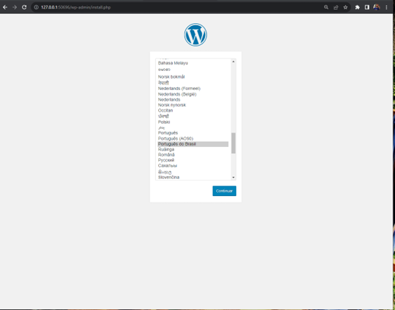
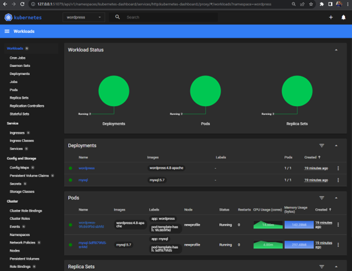
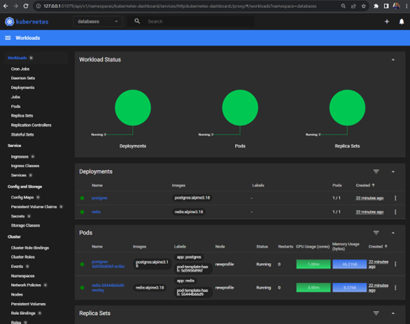

## Documentação Técnica do Projeto: WordPress em Kubernetes via Terraform

## Introdução

Este documento apresenta a implementação detalhada de um ambiente Kubernetes hospedando um servidor WordPress e bancos de dados PostgreSQL e Redis, utilizando a infraestrutura como código por meio do Terraform e Minikube como ambiente loca de desenvolvimento e que pode ser utilizado como modelo para produção, desde que, siga as boas práticas de segurança cloud.

## Pré-requisitos

<b>Minikube</b>: Versão v1.32.0 configurada para simular um ambiente de produção em Kubernetes local. 
<b>Terraform</b>: Versão v1.6.3, utilizada para automatizar a criação de recursos no Kubernetes. 
<b>kubectl</b>: v1.28

## Estrutura do Projeto

O projeto segue uma estrutura modular com diretórios dedicados para o Wordpress e bancos de dados, além de script auxiliar:

<b>/wordpress</b>: Contém os arquivos .tf para a configuração do servidor Wordpress.(Namespace: wordpress) 
<b>/databases</b>: Armazena os arquivos .tf para os bancos de dados PostgreSQL e Redis. (Namespace: databases) 
<b>/scripts</b>: Inclui scripts como load_data.py para inicialização de dados nos bancos e carga de dados. 
<b>/configmaps</b>: Pasta que contém configmaps do projeto. 
<b>/jobs</b>: Este pasta tem um modelo de job que pode ser utilizado para carregar dados a partir de um script python. 
<b>/data</b>: Contém arquivo CSV de com dados de exemplo para inserir estas informações tanto no PostgreSQL quanto no Redis 
 
## Detalhes da Implementação

## WordPress
O módulo do WordPress define um Deployment que é gerenciado para proporcionar alta disponibilidade e escalabilidade. O Terraform configura o Service com um LoadBalancer para expor o WordPress ao acesso no navegador. As variáveis de configuração são injetadas via Secrets para manter as credenciais seguras. Foi utilizado tanto serviço de secrets do Kubernetes para obter dados de credenciais quanto também de outras variáveis do projeto direto no terraform.

## Bancos de Dados
<b>PostgreSQL</b>: Configurado como um StatefulSet para garantir persistência de dados e estabilidade em reinicializações. 
<b>Redis</b>: Também implementado como um StatefulSet similares ao PostgreSQL para manter a segurança dos dados.

## Scripts Auxiliares
<b>load_data.py</b> é um script Python responsável por popular os bancos de dados com dados iniciais. Ele utiliza variáveis de ambiente para conexão, as quais são definidas no Terraform e injetadas no pod durante a execução. Para isso foi criado um configmap para mapear para um pod específico se desejar. 

## Configurações e Ajustes dos Serviços
As configurações específicas como alocação de CPU e memória, foram ajustadas para refletir um ambiente local, proporcionando um teste fidedigno das aplicações. Pode-se utilizar os mesmos parâmetros para produção, apenas ajustando os respectivos valores de CPU e Memória para garantir melhor processamento, se necessário.

## Processo de Deploy
O deploy é realizado através de comandos <b>'terraform init'</b>, <b>'terraform plan'</b> e <b>'terraform apply'</b> dentro de cada diretório do módulo. As dependências entre os módulos são gerenciadas pelo Terraform, assegurando a ordem correta de criação dos recursos.

## Variáveis de Configuração
Todas as variáveis necessárias para a execução dos módulos são utilizadas via 'variables' do terraform ou através de 'metadata' do Kubernetes dos recursos fazendo uso desta função dentro da infraestrutura.

## Segurança
O projeto demonstra tanto as práticas recomendadas de segurança, como as não recomendadas. Porém como estamos tratando de um ambiente local com 'minikube', ele mostra-se como é possível implementar secrets de diferentes maneiras.

## Armazenamento de senhas e credenciais em Secrets.

Criado recursos do tipo Kubernetes Secrets para armazenar senhas do banco de dados. Note que neste projeto voltado para desenvolvimento local foram utilizadas duas abordagens, a primeira que não recomendamos o uso que é configurar no código Terraform as senhas, e outra o uso de Kubernetes Secrets, o que não é ideal para ambientes produtivos. Para produção, recomenda-se o uso de um gerenciador de secrets na Cloud ou Hashicorp Vault para armazenamento de credenciais.

## Manutenção e Monitoramento

Monitoramento é realizado por meio de ferramentas integradas ao Kubernetes, como o dashboard acessível pelo comando 'minikube dashboard' onde poderá visualizar todos os recursos do ambiente. E assim facilitar em possíveis análises para efetuar manutenções requeridas e programadas.

## Carregar dados nas bases PostgreSQL e Redis

A configuração para carregar dados consiste das pastas <b>‘configmaps’</b> e <b>‘jobs’</b>. Para aplicar o configmap executar <b>terraform plan</b>, <b>terraform apply</b> na raíz do projeto para que ele leia o arquivo YAML na pasta de configmaps que vai executar o script que nele está configurado. O script lê o arquivo <b>CSV</b> na pasta <b>‘data‘</b> e insere os dados tanto na base do PostgreSQL quanto do Redis. Este exemplo visa, inserir os mesmos dados em ambos os bancos, se precisássemos separar os processos, bastaria criar outro configmap e atualizar nele o script mantendo apenas a função que carrega os dados naquele banco especificamente.

Se desejar aplicar a partir do seu ambiente local, faça o expose do serviço do PostgreSQL e Redis com os comandos <b>‘minikube service -n databases postgres-service’</b> e <b>‘minikube service -n databases redis’</b>. Com a URL gerada por esses comandos, utilize no seu client o endereço <b>127.0.0.1:PORTA</b> fornecido no resultado dos comandos para se conectar e  efetuar as queries que desejar ou carregar arquivo batch de lotes para inserir novos dados. Ou pode-se também com o serviço exposto, executar diretamente o arquivo Python na pasta <b>‘scripts’</b> que ele fará a carga dos dados no banco no cluster Kubernetes a partir do seu ambiente local.
  
## Passo a Passo  para executar esta solução no ambiente local com Minikube

Após instalar o terraform e minikube, faça os passos abaixo.

1-Execute <b>minikube start</b> 
2-Execute <b>minikube addons enable ingress</b> e <b>minikube addons enable ingress-dns</b> (Criação de Ingress do tipo Nginx). 
3-Execute <b>minikube addons enable metrics-server</b> para habilitar métricas de uso dos recursos no monitoramento. 
4-Em outro Prompt de Comando, execute <b>minikube dashboard</b> (para exibir o monitoramento dos recursos). 
5-Aplicar o terraform iniciando pela pasta ‘databases’, ‘configmaps’ (na raíz do projeto) e por fim a pasta ‘wordpress’. 
6-Execute <b>minikube service wordpress -n wordpress</b> para expor o serviço do Wordpress e obter a URL de acesso. 
7-Acessar o serviço através da URL gerada no passo 5. 

## Realizado os passos acima, e acessar a URL no navegador fornecida pelo minikube, a seguinte tela será apresentada.

 
Desta forma, a aplicação está pronta para ser configurada e utilizada.
E no monitoramento (Dashboard) os serviços implementados nesta solução com métricas de CPU e Memória.  

   

